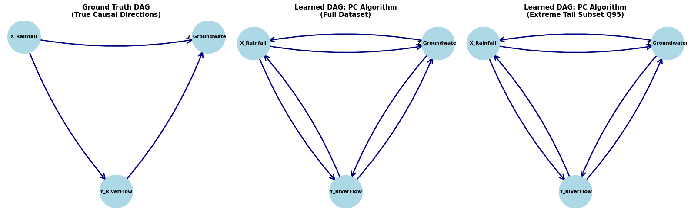

# Causal Structure Learning under Extreme Value Regimes

## Overview
This project benchmarks classical causal structure learning algorithms (specifically the constraint-based PC algorithm) on heavy-tailed, Pareto-distributed Structural Causal Models (SCMs). It highlights the core theoretical failure mode: standard conditional independence tests treat extreme-tail dependencies symmetrically, causing algorithms to output bidirected edge skeletons rather than true directed acyclic graphs (DAGs).

## Key Empirical Results



### 1. Tail Dependence Coefficients ($\chi$ at $q = 0.95$)
- **$\chi(X_{Rainfall} \to Y_{RiverFlow})$:** 0.7475
- **$\chi(Y_{RiverFlow} \to Z_{Groundwater})$:** 0.6900
- **$\chi(X_{Rainfall} \to Z_{Groundwater})$:** 0.6600

### 2. Methodological Findings
- **Skeleton Recovery:** The PC algorithm successfully identifies edge connections across all variable pairs.
- **Orientation Failure:** Because standard Gaussian-based independence tests do not account for asymmetric tail-decay properties, the PC algorithm outputs symmetric adjacency matrices ($X \leftrightarrow Y \leftrightarrow Z$).

---

## Installation & Execution

1. Clone the repository:
   ```bash
   git clone [https://github.com/ikechukwukamalu8/extremal-causal-learning.git](https://github.com/ikechukwukamalu8/extremal-causal-learning.git)
   cd extremal-causal-learning
